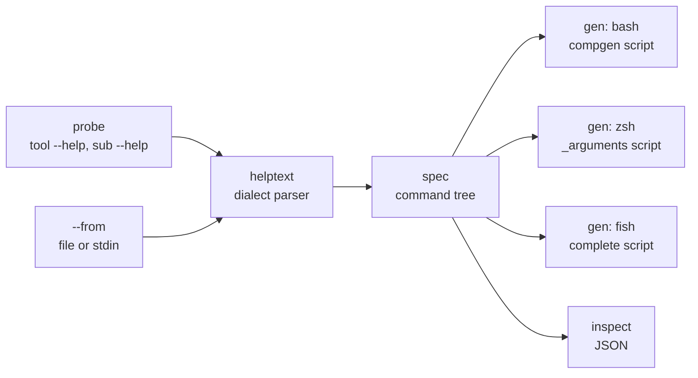

# tabsmith

[English](README.md) | [中文](README.zh.md) | [日本語](README.ja.md)

[](LICENSE) [](go.mod) [](CHANGELOG.md)  [](CONTRIBUTING.md)

**tabsmith：オープンソースのシェル補完鍛冶場——任意の CLI 自身の --help 出力を解析し、bash・zsh・fish の Tab 補完スクリプトを生成する。文法ファイルも、ソースコードへのアクセスも不要。**


```bash
git clone https://github.com/JaydenCJ/tabsmith.git && cd tabsmith && go install ./cmd/tabsmith
```

> プレリリース：v0.1.0 はまだ module proxy のタグを公開していないため、上記の手順でソースからインストールしてください。単一の静的バイナリで、ランタイム依存はゼロ。

## なぜ tabsmith？

何千もの小さな CLI はシェル補完をまったく同梱していない：メンテナは互いに異なる 3 方言（bash の `compgen`、zsh の `_arguments`、fish の `complete`）を手書きして永遠に同期し続ける必要があり、だからほとんどの人は書かない——そしてユーザーのあなたにも直せない。既存のジェネレータはどれも、あなたの手元にないものを要求するからだ。cobra や clap の内蔵ジェネレータはツールがそのフレームワークで作られ、作者が配線した場合にしか使えない；complgen はツールごとに手書きの文法ファイルを要求する；carapace はツールごとの spec に加えて、全マシンに常駐する自前のバイナリを要求する。tabsmith はどの CLI もすでに持っている唯一の成果物、`--help` から出発する。対象バイナリのヘルプコマンドを実行し（しかもヘルプコマンドだけを——`tool sub --help` を再帰的に、タイムアウトとプローブ予算つきで）、getopt / argparse / cobra / clap / click / BusyBox / Go `flag` の各方言を解析し、テキストからフラグ・サブコマンド・列挙値・ファイル引数を掘り出し、source・配布・コミットできる 3 つのネイティブ補完スクリプトを鍛え上げる。プラグインなし、デーモンなし、文法ファイルなし——しかも自分の所有していないバイナリにも効く。

| | tabsmith | 手書き補完 | complgen | carapace |
| --- | --- | --- | --- | --- |
| 必要な入力 | ツールの `--help` 出力、それだけ | 3 方言を手書きし同期し続ける | ツールごとに手書きの `.usage` 文法 | ツールごとの YAML spec、または内蔵 spec |
| 自分の管理外のツール | 可——バイナリを探査、またはヘルプ文を貼り付け | 自分で書いた場合のみ | 文法を書いた場合のみ | spec が既にある場合のみ |
| 1 つのソースから対応するシェル | bash・zsh・fish | シェルごとに 1 ファイル | bash・zsh・fish | 多数、ただしランタイムでブリッジ |
| ユーザーマシン上のランタイム | なし——素のネイティブスクリプト | なし | なし | carapace バイナリが常駐 |
| フラグ値の列挙 | プレースホルダとヘルプ文から採掘 | 手作業で保守 | 文法に記述 | spec に記述 |
| ツール 1 つあたりの手間 | コマンド 1 回 | 数時間 × 3 | 数十分 | 数十分 |

<sub>比較は 2026-07 時点の各上流ドキュメントに基づく。carapace は有名ツールの spec を同梱している；この行は spec が存在しないロングテールの CLI について述べている。</sub>

## 特徴

- **入力ゼロの生成** — バイナリを指すだけ：`tabsmith gen mytool`。探査は `--help`、`-h`、`help` の順に試し、stdout も stderr も受け付け、非ゼロ終了を許容し、ヘルプコマンド以外は決して実行せず、各呼び出しにハードタイムアウトを課す。
- **7 つのヘルプ方言、1 つのパーサ** — GNU getopt、Python argparse（subparsers 含む）、cobra、clap、click、BusyBox、Go `flag` パッケージ、さらに ANSI カラー・OSC ハイパーリンク・タブ整列・man 式 overstrike をすべて解析前に正規化。
- **値のインテリジェンス** — `{json,xml}` や `<auto|never>` のプレースホルダ、clap の `[possible values: …]`、"one of: …" リスト、GNU の引用符付き `'always', 'never', or 'auto'` 文がすべて列挙補完になる；`FILE`/`DIR` プレースホルダと `--*-file`/`--*-dir` 名はネイティブのファイル・ディレクトリ補完になる。
- **ネストしたサブコマンドを防御的に探査** — 列挙されたコマンドを深さ上限まで再帰的に辿る；各ヘルプ画面をフィンガープリントするため、未知の引数を無視してルートのヘルプを再表示するツールは、無限の木ではなくきれいな葉になる。
- **3 つのネイティブスクリプト、シムなし** — 素の `compgen` の bash、`_arguments`+`_describe` の zsh、ネスト対応の小さな生成パスリゾルバを持つ fish の `complete`；`--color[=WHEN]` のような省略可能引数のフラグが次の語を飲み込むことはない。
- **決定的・オフライン・正直** — 同一入力にはバイト単位で同一の出力（スクリプトをコミットして diff できる）、ネットワークなし、テレメトリなし；ヘルプ文から使える情報が何も採れないときは、空のスクリプトを出す代わりにそう明言して終了コード 1 で終わる。

## クイックスタート

同梱のデモ CLI の補完を生成する（PATH 上のどのバイナリでも同じ使い方）：

```bash
cd examples
tabsmith gen --out completions ./shipctl
```

実際にキャプチャした出力：

```text
tabsmith: parsed shipctl: 13 flags, 4 subcommands
tabsmith: wrote completions/shipctl.bash
tabsmith: wrote completions/_shipctl
tabsmith: wrote completions/shipctl.fish
```

bash スクリプトを source すれば、このツールは最初から補完を持っていたかのように振る舞う：

```bash
source completions/shipctl.bash
shipctl dep<Tab>                  # → deploy
shipctl deploy --strategy <Tab>   # → bluegreen  canary  rolling
shipctl deploy history --<Tab>    # → --json  --limit
```

strategy の値はヘルプ文中の `one of: rolling, canary, bluegreen` という一文から採掘された；`deploy history` は `shipctl deploy --help`、次いで `shipctl deploy history --help` を探査して発見された。

手元にバイナリがない？保存済みのヘルプ文をパイプすればいい——何も実行されない：

```bash
kubectl --help | tabsmith gen --from - --name kubectl --shell fish > kubectl.fish
```

## CLI リファレンス

`tabsmith gen [options] <tool>` は補完スクリプトを書き出す；`tabsmith inspect [options] <tool>` は解析済みコマンドツリーを JSON で出力する——それはジェネレータが受け取る入力そのものだ。

| Key | Default | Effect |
| --- | --- | --- |
| `--shell` | `all` | 対象方言：`bash`・`zsh`・`fish`・`all`（`all` の書き出しには `--out` が必要） |
| `--out` | *(stdout)* | `<tool>.bash`・`_<tool>`・`<tool>.fish` をこのディレクトリに書き出す |
| `--from` | *(探査)* | ツールを実行せず、このヘルプ文ファイル（stdin は `-`）を解析する |
| `--name` | ベース名 | スクリプトに登録するツール名（`--from -` のとき必須） |
| `--depth` | `2` | ルートの下に探査するサブコマンドの階層数 |
| `--timeout` | `5` | ヘルプ呼び出し 1 回に許す秒数 |

終了コード：`0` 成功、`1` ヘルプ文に使える情報なし、`2` 用法または探査エラー。方言の完全な一覧——パーサが手がかりにするすべての形——は [docs/help-dialects.md](docs/help-dialects.md) にある。

## アーキテクチャ



`gen` は左から右へ流れる；`inspect` はツリーで止まるので、ジェネレータを疑う前に何が解析されたかを正確に確認できる。

## ロードマップ

- [x] v0.1.0 — 探査 + `--from` パイプライン、7 つのヘルプ方言、列挙/ファイル採掘、再帰的サブコマンド発見、bash/zsh/fish ジェネレータ、JSON inspect、91 テスト + smoke スクリプト
- [ ] bash の `--flag=value` 同語内の値補完
- [ ] man ページ取り込み（`tabsmith gen --man tool`）——help より man が充実したツール向け
- [ ] パッチファイル：出力を fork せずに解析結果を手修正（見逃した列挙の追加、フラグの非表示）
- [ ] バッチモード：`$PATH` を走査し、補完未導入のツールを見つけて足りない分を鍛造
- [ ] elvish と PowerShell ターゲット

完全なリストは [open issues](https://github.com/JaydenCJ/tabsmith/issues) を参照。

## コントリビュート

生のヘルプ文を添えたバグ報告、新しい方言のサンプル、pull request を歓迎する——ローカルのワークフロー（`go test ./...` と `SMOKE OK` を出力する `scripts/smoke.sh`）は [CONTRIBUTING.md](CONTRIBUTING.md) を参照。入門しやすい課題には [good first issue](https://github.com/JaydenCJ/tabsmith/issues?q=is%3Aissue+is%3Aopen+label%3A%22good+first+issue%22) のラベルがあり、設計の議論は [Discussions](https://github.com/JaydenCJ/tabsmith/discussions) で行われている。

## ライセンス

[MIT](LICENSE)
