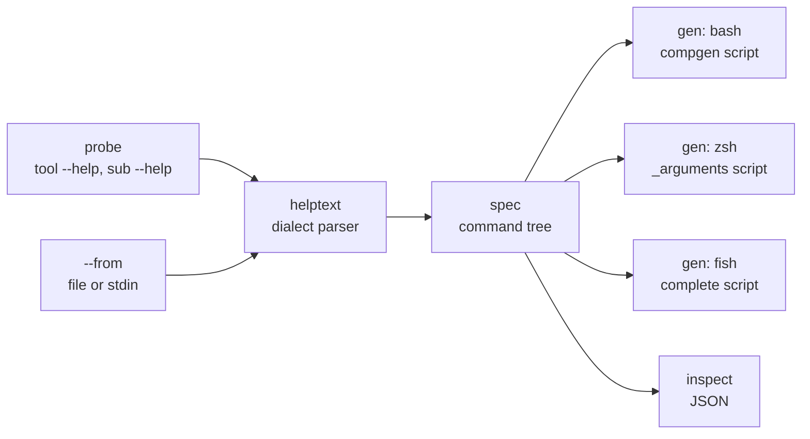

# tabsmith

[English](README.md) | [中文](README.zh.md) | [日本語](README.ja.md)

[](LICENSE) [](go.mod) [](CHANGELOG.md)  [](CONTRIBUTING.md)

**tabsmith：an open-source completion forge for the shell — it parses any CLI's own --help output and emits bash, zsh and fish tab-completions, with no grammar file and no access to the source.**


```bash
git clone https://github.com/JaydenCJ/tabsmith.git && cd tabsmith && go install ./cmd/tabsmith
```

> Pre-release: v0.1.0 is not yet published to a module proxy tag; install from source as above. A single static binary, zero runtime dependencies.

## Why tabsmith?

Thousands of small CLIs ship no shell completions at all: their maintainers would have to hand-write and forever synchronize three different dialects (bash's `compgen`, zsh's `_arguments`, fish's `complete`), so most never do — and as a user you cannot fix it, because the existing generators all need something you don't have. cobra's and clap's built-in generators only work if the tool was built on that framework and the author wired them in; complgen wants a hand-written grammar file per tool; carapace wants a per-tool spec plus its own binary running on every machine. tabsmith starts from the one artifact every CLI already has: `--help`. It runs the binary's help commands (and only its help commands — recursively, `tool sub --help`, under a timeout and a probe budget), parses the getopt / argparse / cobra / clap / click / BusyBox / Go-`flag` dialects, mines flags, subcommands, enum values and file arguments out of the text, and forges three native completion scripts you can source, ship or commit. No plugin, no daemon, no grammar — and it works on binaries you don't own.

| | tabsmith | hand-written | complgen | carapace |
| --- | --- | --- | --- | --- |
| Input required | the tool's `--help` output, nothing else | three dialects written and re-synced by hand | a hand-written `.usage` grammar per tool | a per-tool YAML spec, or a built-in one |
| Tools you don't control | yes — probe the binary, or paste its help text | only if you write them yourself | only if you write the grammar | only if a spec already exists |
| Shells from one source | bash, zsh, fish | one file per shell | bash, zsh, fish | many, bridged at runtime |
| Runtime on the user's machine | none — plain native scripts | none | none | the carapace binary, always running |
| Flag-value enums | mined from placeholders and help prose | hand-maintained | encoded in the grammar | encoded in the spec |
| Effort per tool | one command | hours, times three | tens of minutes | tens of minutes |

<sub>Comparison reflects upstream documentation as of 2026-07. carapace ships specs for well-known tools; the row describes the long tail of CLIs that have none.</sub>

## Features

- **Zero-input generation** — point it at a binary: `tabsmith gen mytool`. Probing tries `--help`, `-h`, then `help`, accepts stdout or stderr, tolerates non-zero exits, and never runs anything but help commands, each under a hard timeout.
- **Seven help dialects, one parser** — GNU getopt, Python argparse (including subparsers), cobra, clap, click, BusyBox and the Go `flag` package, plus ANSI colors, OSC hyperlinks, tab alignment and man-style overstrike, all normalized before parsing.
- **Value intelligence** — `{json,xml}` and `<auto|never>` placeholders, clap's `[possible values: …]`, "one of: …" lists and GNU's quoted `'always', 'never', or 'auto'` prose become enum completions; `FILE`/`DIR` placeholders and `--*-file`/`--*-dir` names become native file and directory completion.
- **Nested subcommands, probed defensively** — listed commands are walked recursively to a depth limit; every help screen is fingerprinted, so a tool that ignores unknown arguments and re-prints its root help yields a clean leaf instead of an infinite tree.
- **Three native scripts, no shim** — plain `compgen` bash, `_arguments`+`_describe` zsh, `complete` fish with a tiny generated path resolver for nesting; optional-argument flags like `--color[=WHEN]` never swallow the next word.
- **Deterministic, offline, honest** — byte-identical output for identical input (commit the scripts and diff them), no network, no telemetry; when help text yields nothing usable, tabsmith says so and exits 1 instead of emitting an empty script.

## Quickstart

Generate completions for the bundled demo CLI (any binary on your PATH works the same):

```bash
cd examples
tabsmith gen --out completions ./shipctl
```

Real captured output:

```text
tabsmith: parsed shipctl: 13 flags, 4 subcommands
tabsmith: wrote completions/shipctl.bash
tabsmith: wrote completions/_shipctl
tabsmith: wrote completions/shipctl.fish
```

Source the bash script and the tool completes like it always had completions:

```bash
source completions/shipctl.bash
shipctl dep<Tab>                  # → deploy
shipctl deploy --strategy <Tab>   # → bluegreen  canary  rolling
shipctl deploy history --<Tab>    # → --json  --limit
```

The strategy values were mined from the phrase `one of: rolling, canary, bluegreen` in the help text; `deploy history` was discovered by probing `shipctl deploy --help`, then `shipctl deploy history --help`.

No binary at hand? Pipe saved help text through instead — nothing is executed:

```bash
kubectl --help | tabsmith gen --from - --name kubectl --shell fish > kubectl.fish
```

## CLI reference

`tabsmith gen [options] <tool>` writes completion scripts; `tabsmith inspect [options] <tool>` prints the parsed command tree as JSON, which is the exact input the generators work from.

| Key | Default | Effect |
| --- | --- | --- |
| `--shell` | `all` | target dialect: `bash`, `zsh`, `fish`, or `all` (writing `all` needs `--out`) |
| `--out` | *(stdout)* | write `<tool>.bash`, `_<tool>` and `<tool>.fish` into this directory |
| `--from` | *(probe)* | parse this help-text file (or `-` for stdin) instead of running the tool |
| `--name` | basename | tool name registered in the scripts (required with `--from -`) |
| `--depth` | `2` | subcommand levels to probe below the root |
| `--timeout` | `5` | seconds allowed per help invocation |

Exit codes: `0` success, `1` help text contained nothing usable, `2` usage or probe error. The full dialect inventory — every shape the parser keys on — lives in [docs/help-dialects.md](docs/help-dialects.md).

## Architecture



`gen` flows left to right; `inspect` stops at the tree so you can see exactly what was parsed before blaming a generator.

## Roadmap

- [x] v0.1.0 — probe + `--from` pipelines, seven help dialects, enum/file mining, recursive subcommand discovery, bash/zsh/fish generators, JSON inspect, 91 tests + smoke script
- [ ] bash `--flag=value` attached-form value completion
- [ ] man-page ingestion (`tabsmith gen --man tool`) for tools with richer man pages than help
- [ ] patch files to hand-correct a parse (add a missed enum, hide a flag) without forking the output
- [ ] batch mode: scan `$PATH`, find tools with no completions installed, forge the missing ones
- [ ] elvish and PowerShell targets

See the [open issues](https://github.com/JaydenCJ/tabsmith/issues) for the full list.

## Contributing

Bug reports with raw help text, new dialect samples and pull requests are all welcome — see [CONTRIBUTING.md](CONTRIBUTING.md) for the local workflow (`go test ./...` plus `scripts/smoke.sh` printing `SMOKE OK`). Good entry points are labelled [good first issue](https://github.com/JaydenCJ/tabsmith/issues?q=is%3Aissue+is%3Aopen+label%3A%22good+first+issue%22), and design questions live in [Discussions](https://github.com/JaydenCJ/tabsmith/discussions).

## License

[MIT](LICENSE)
