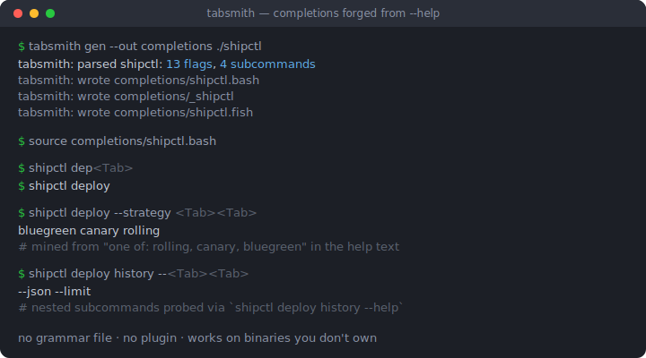
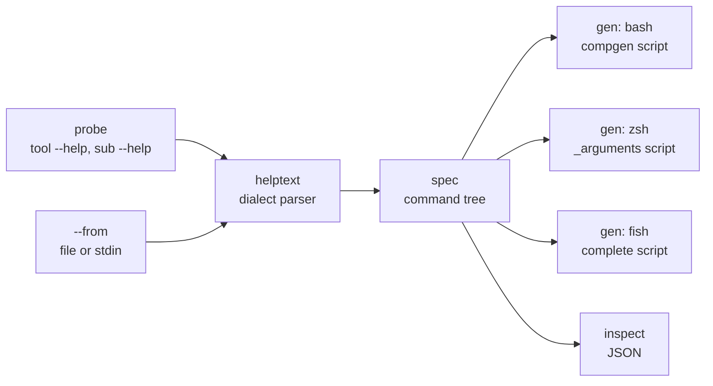

# tabsmith

[English](README.md) | [中文](README.zh.md) | [日本語](README.ja.md)

[](LICENSE) [](go.mod) [](CHANGELOG.md)  [](CONTRIBUTING.md)

**tabsmith：一个开源的 shell 补全锻造器——解析任意 CLI 自己的 --help 输出，生成 bash、zsh、fish 三种 Tab 补全脚本；不需要语法文件，也不需要接触源码。**



```bash
git clone https://github.com/JaydenCJ/tabsmith.git && cd tabsmith && go install ./cmd/tabsmith
```

> 预发布：v0.1.0 尚未发布 module proxy 标签，请按上述方式从源码安装。单个静态二进制，零运行时依赖。

## 为什么是 tabsmith？

成千上万的小型 CLI 根本不带 shell 补全：维护者得手写并永远同步三种互不相同的方言（bash 的 `compgen`、zsh 的 `_arguments`、fish 的 `complete`），所以大多数人干脆不写——而作为用户你也无能为力，因为现有的生成器都需要你拿不到的东西。cobra 和 clap 的内置生成器只在工具基于该框架构建且作者接好了线时才有用；complgen 要求为每个工具手写一份语法文件；carapace 要求每个工具一份 spec，还要在每台机器上常驻它自己的二进制。tabsmith 从每个 CLI 都已经有的那件东西出发：`--help`。它运行目标二进制的帮助命令（而且只运行帮助命令——递归地执行 `tool sub --help`，带超时和探测预算），解析 getopt / argparse / cobra / clap / click / BusyBox / Go `flag` 各种方言，从文本里挖出 flag、子命令、枚举值和文件参数，锻造出三份原生补全脚本，可以 source、分发或提交进仓库。没有插件、没有守护进程、没有语法文件——而且对你不拥有的二进制同样有效。

| | tabsmith | 手写补全 | complgen | carapace |
| --- | --- | --- | --- | --- |
| 所需输入 | 工具的 `--help` 输出，仅此而已 | 手写并持续同步三种方言 | 每个工具一份手写 `.usage` 语法 | 每个工具一份 YAML spec，或内置 spec |
| 不受你控制的工具 | 可以——探测二进制，或粘贴其帮助文本 | 只有你亲自写才行 | 只有你写出语法才行 | 只有已存在 spec 才行 |
| 一份来源覆盖的 shell | bash、zsh、fish | 每种 shell 一个文件 | bash、zsh、fish | 很多种，但靠运行时桥接 |
| 用户机器上的运行时 | 无——纯原生脚本 | 无 | 无 | carapace 二进制，常驻运行 |
| flag 取值枚举 | 从占位符和帮助文案中挖掘 | 手工维护 | 编码在语法里 | 编码在 spec 里 |
| 每个工具的工作量 | 一条命令 | 数小时，乘以三 | 几十分钟 | 几十分钟 |

<sub>对比基于 2026-07 时各上游文档。carapace 为知名工具内置了 spec；此行描述的是没有任何 spec 的长尾 CLI。</sub>

## 特性

- **零输入生成** — 指向一个二进制即可：`tabsmith gen mytool`。探测依次尝试 `--help`、`-h`、`help`，接受 stdout 或 stderr，容忍非零退出码，并且除帮助命令外绝不执行任何东西，每次调用都有硬超时。
- **七种帮助方言，一个解析器** — GNU getopt、Python argparse（含 subparsers）、cobra、clap、click、BusyBox 和 Go `flag` 包，外加 ANSI 颜色、OSC 超链接、制表符对齐与 man 式 overstrike，全部在解析前归一化。
- **取值智能** — `{json,xml}` 与 `<auto|never>` 占位符、clap 的 `[possible values: …]`、"one of: …" 列表和 GNU 引号式 `'always', 'never', or 'auto'` 文案都变成枚举补全；`FILE`/`DIR` 占位符和 `--*-file`/`--*-dir` 名称变成原生文件与目录补全。
- **嵌套子命令，防御式探测** — 列出的命令按深度上限递归走查；每屏帮助都做指纹，忽略未知参数、重印根帮助的工具会得到干净的叶节点，而不是无限嵌套的树。
- **三份原生脚本，无垫片** — 纯 `compgen` 的 bash、`_arguments`+`_describe` 的 zsh、带一个小型生成路径解析器以支持嵌套的 fish `complete`；`--color[=WHEN]` 这类可选参数 flag 绝不吞掉下一个词。
- **确定性、离线、诚实** — 相同输入产生逐字节相同的输出（可以把脚本提交进仓库做 diff），无网络、无遥测；当帮助文本挖不出任何可用信息时，tabsmith 会明说并以退出码 1 结束，而不是生成一份空脚本。

## 快速上手

为随附的演示 CLI 生成补全（PATH 里的任何二进制用法相同）：

```bash
cd examples
tabsmith gen --out completions ./shipctl
```

真实捕获的输出：

```text
tabsmith: parsed shipctl: 13 flags, 4 subcommands
tabsmith: wrote completions/shipctl.bash
tabsmith: wrote completions/_shipctl
tabsmith: wrote completions/shipctl.fish
```

source 那份 bash 脚本，这个工具就像一直带着补全一样：

```bash
source completions/shipctl.bash
shipctl dep<Tab>                  # → deploy
shipctl deploy --strategy <Tab>   # → bluegreen  canary  rolling
shipctl deploy history --<Tab>    # → --json  --limit
```

strategy 的取值是从帮助文本里的 `one of: rolling, canary, bluegreen` 一句挖出来的；`deploy history` 则是先探测 `shipctl deploy --help`、再探测 `shipctl deploy history --help` 发现的。

手头没有二进制？改为用管道输入保存下来的帮助文本——不会执行任何东西：

```bash
kubectl --help | tabsmith gen --from - --name kubectl --shell fish > kubectl.fish
```

## CLI 参考

`tabsmith gen [options] <tool>` 写出补全脚本；`tabsmith inspect [options] <tool>` 把解析出的命令树打印为 JSON——那正是生成器工作的精确输入。

| Key | Default | Effect |
| --- | --- | --- |
| `--shell` | `all` | 目标方言：`bash`、`zsh`、`fish` 或 `all`（写 `all` 需要 `--out`） |
| `--out` | *(stdout)* | 把 `<tool>.bash`、`_<tool>` 和 `<tool>.fish` 写入该目录 |
| `--from` | *(探测)* | 解析该帮助文本文件（或 `-` 表示 stdin），不运行工具 |
| `--name` | 文件名 | 脚本中注册的工具名（配合 `--from -` 时必填） |
| `--depth` | `2` | 根以下要探测的子命令层数 |
| `--timeout` | `5` | 每次帮助调用允许的秒数 |

退出码：`0` 成功，`1` 帮助文本中没有可用信息，`2` 用法或探测错误。完整的方言清单——解析器识别的每一种形状——见 [docs/help-dialects.md](docs/help-dialects.md)。

## 架构



`gen` 从左流向右；`inspect` 停在命令树这一步，让你在归咎某个生成器之前先看清解析到了什么。

## 路线图

- [x] v0.1.0 — 探测 + `--from` 管道、七种帮助方言、枚举/文件挖掘、递归子命令发现、bash/zsh/fish 生成器、JSON inspect、91 个测试 + smoke 脚本
- [ ] bash 的 `--flag=value` 同词取值补全
- [ ] man 手册页摄取（`tabsmith gen --man tool`），服务 man 比 help 更丰富的工具
- [ ] 补丁文件：手工修正一次解析（补一个漏掉的枚举、隐藏一个 flag）而无需 fork 输出
- [ ] 批量模式：扫描 `$PATH`，找出未安装补全的工具，把缺的都锻造出来
- [ ] elvish 与 PowerShell 目标

完整列表见 [open issues](https://github.com/JaydenCJ/tabsmith/issues)。

## 参与贡献

欢迎附带原始帮助文本的 bug 报告、新方言样本和 pull request——本地工作流（`go test ./...` 加上打印 `SMOKE OK` 的 `scripts/smoke.sh`）见 [CONTRIBUTING.md](CONTRIBUTING.md)。入门任务标记为 [good first issue](https://github.com/JaydenCJ/tabsmith/issues?q=is%3Aissue+is%3Aopen+label%3A%22good+first+issue%22)，设计讨论在 [Discussions](https://github.com/JaydenCJ/tabsmith/discussions)。

## 许可证

[MIT](LICENSE)
